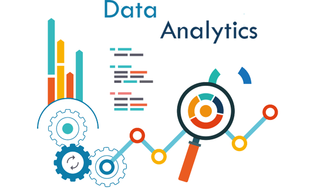
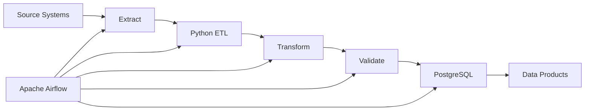
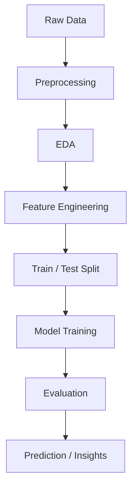

# Marcelo Chávez

### Data Scientist · Statistical Engineer · Data Engineering

**Python · Machine Learning · Estadística · Apache Airflow · R**

  <a href="documentos/CV_MARCELO_CHAVEZ.pdf"><b>Hoja de Vida</b></a> |
  <a href="https://www.linkedin.com/in/marcelochavezec/"><b>LinkedIn</b></a> |
  <a href="mailto:marcelo_chavez_ec@outlook.com"><b>Email</b></a>

---

## Sobre mí

Soy **Ingeniero en Estadística Informática** especializado en **Ciencia de Datos, Machine Learning, Estadística Aplicada e Ingeniería de Datos**.

Mi principal lenguaje de trabajo es **Python**, utilizado para análisis de datos, automatización, construcción de pipelines ETL, Machine Learning e integración con bases de datos.

Complemento este ecosistema con **R** para modelamiento estadístico, métodos multivariantes, análisis exploratorio y desarrollo de aplicaciones analíticas con **Shiny**.

* 🐍 **Python para Data Science y Data Engineering**
* 🤖 Machine Learning y modelamiento predictivo
* 📊 Estadística aplicada y métodos multivariantes
* ⚙️ Automatización de procesos ETL
* 🌬️ Orquestación de workflows con **Apache Airflow**
* 🗄️ PostgreSQL y SQL
* 🐳 Docker y entornos reproducibles
* 📈 Aplicaciones y productos analíticos
* 🏥 Analítica de datos e indicadores de salud
* 📍 Quito, Ecuador

 

---

## Core Stack

<table>
<tr>

<td align="center" width="220">

 
<b>Python</b>
 
Data Science · Machine Learning · ETL · Automation
</td>

<td align="center" width="190">

 
<b>R</b>
 
Statistics · Multivariate Analysis
</td>

<td align="center" width="190">

 
<b>Shiny</b>
 
Analytical Applications
</td>

</tr>
</table>

---

## Python for Data Science

**Pandas · NumPy · Scikit-learn · Matplotlib · SQLAlchemy · ETL · Automation**

Python constituye el núcleo de mi trabajo para:

* Limpieza, transformación y procesamiento de datos
* Análisis exploratorio de datos
* Modelamiento estadístico
* Machine Learning
* Clasificación, regresión y clustering
* Construcción de pipelines ETL
* Integración con PostgreSQL
* Automatización de procesos
* Orquestación mediante **Apache Airflow**

---

## Python Data Workflow

---

## Data Engineering with Python + Apache Airflow

---

## Machine Learning Workflow

---

## Áreas de especialización

<table>

<tr>

<td width="50%" valign="top">

### 🤖 Machine Learning

* Clasificación
* Regresión
* Clustering
* Selección de variables
* Feature engineering
* Evaluación de modelos
* Pipelines reproducibles

</td>

<td width="50%" valign="top">

### ⚙️ Data Engineering

* Python
* PostgreSQL
* SQL
* Apache Airflow
* Docker
* ETL / ELT
* Automatización de pipelines

</td>

</tr>

<tr>

<td width="50%" valign="top">

### 📐 Statistical Science

* Estadística descriptiva e inferencial
* Métodos multivariantes
* Modelamiento estadístico
* Análisis exploratorio
* Construcción de indicadores

</td>

<td width="50%" valign="top">

### 📊 Data Applications

* Shiny
* Visualización analítica
* Dashboards
* Sistemas de información
* Productos analíticos

</td>

</tr>

</table>

---

## Tecnologías principales

### Programming

**Python** · **R** · **SQL**

### Data Science

**Pandas** · **NumPy** · **Scikit-learn**

### Data Engineering

**PostgreSQL** · **Apache Airflow** · **Docker** · **ETL**

### Analytics

**Shiny** · **Matplotlib** · **ggplot2**

### Development

**Git** · **GitHub** · **Linux**

---

## Mi enfoque

Mi trabajo se desarrolla principalmente en la intersección de:

### Python + Machine Learning + Data Engineering + Estadística Aplicada

con énfasis en la construcción de soluciones analíticas reproducibles, automatizadas y orientadas a transformar datos en información útil para la toma de decisiones.

---

## Contacto

  <a href="documentos/CV_MARCELO_CHAVEZ.pdf"><b>Hoja de Vida</b></a> |
  <a href="https://www.linkedin.com/in/marcelochavezec/"><b>LinkedIn</b></a> |
  <a href="mailto:marcelo_chavez_ec@outlook.com"><b>Email</b></a>

### Data Scientist

**Python · Machine Learning · Apache Airflow · Statistical Engineering**

Building reproducible and data-driven analytical solutions.

