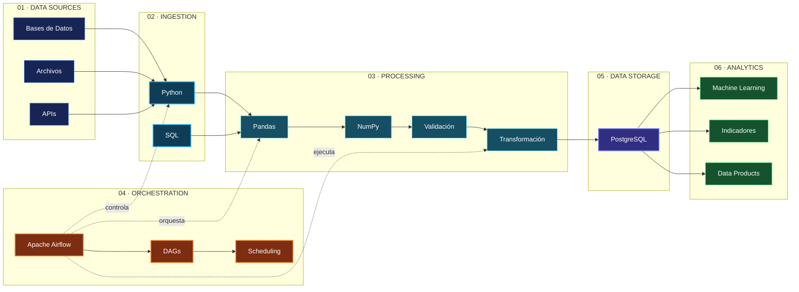
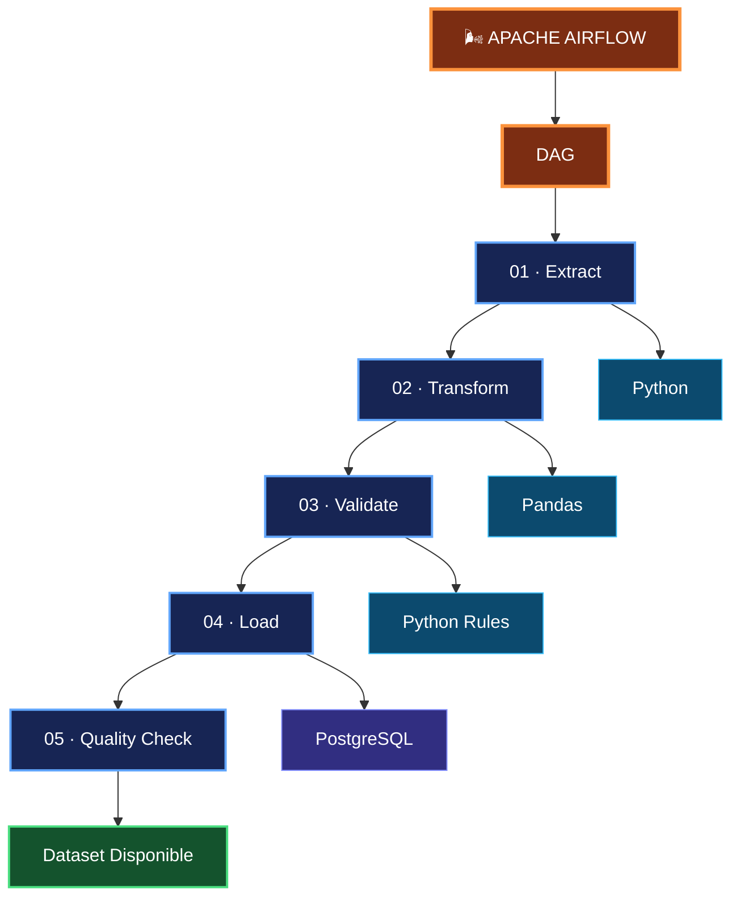
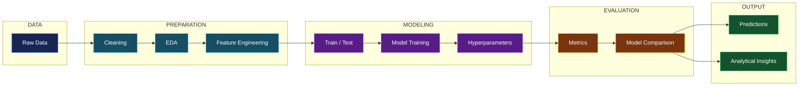

# Marcelo Chávez

### Data Scientist · Statistical Engineer · Data Engineering

**Python · Machine Learning · Apache Airflow · PostgreSQL · R**

 

<table>
<tr>
<td align="center"><b>📍 Ubicación</b> Quito · Ecuador</td>
<td align="center"><b>📄 Perfil Profesional</b> <a href="documentos/CV_MARCELO_CHAVEZ.pdf">Hoja de Vida</a></td>
<td align="center"><b>🌐 LinkedIn</b> <a href="https://www.linkedin.com/in/marcelochavezec/">marcelochavezec</a></td>
<td align="center"><b>✉️ Contacto</b> <a href="mailto:marcelo_chavez_ec@outlook.com">Email</a></td>
</tr>
</table>

---

## 👨‍💻 Sobre mí

Soy **Ingeniero en Estadística Informática** especializado en **Ciencia de Datos, Machine Learning, Estadística Aplicada e Ingeniería de Datos**.

Mi principal ecosistema de trabajo es **Python**, utilizado para desarrollar procesos de análisis, transformación de datos, modelos de Machine Learning, automatizaciones y pipelines ETL.

La ejecución y calendarización de procesos de datos se complementa con **Apache Airflow**, mientras que **PostgreSQL** constituye una de las principales tecnologías utilizadas para almacenamiento, procesamiento e integración de información.

**R** complementa este ecosistema principalmente para modelamiento estadístico, métodos multivariantes, análisis exploratorio y desarrollo de aplicaciones analíticas con Shiny.

 

* 🐍 **Python** para Data Science, Machine Learning y Data Engineering
* 🤖 Modelamiento predictivo y aprendizaje automático
* ⚙️ Procesos ETL automatizados
* 🌬️ Orquestación de workflows con **Apache Airflow**
* 🗄️ PostgreSQL y SQL
* 🐳 Docker y ambientes reproducibles
* 📐 Estadística aplicada y métodos multivariantes
* 📊 Aplicaciones analíticas con R + Shiny
* 🏥 Analítica de datos e indicadores de salud

 

---

# 🧠 Data Science Ecosystem

<table>

<tr>

<td align="center" width="220">

  
<b>PYTHON</b>
 
Data Science · ML · ETL
</td>

<td align="center" width="220">
<b>🌬️</b>
  
<b>APACHE AIRFLOW</b>
 
Workflow Orchestration
</td>

<td align="center" width="220">
<b>🗄️</b>
  
<b>POSTGRESQL</b>
 
Data Storage · SQL
</td>

</tr>

<tr>

<td align="center">

  
<b>R</b>
 
Statistical Computing
</td>

<td align="center">

  
<b>SHINY</b>
 
Analytical Applications
</td>

<td align="center">
<b>🐳</b>
  
<b>DOCKER</b>
 
Reproducible Environments
</td>

</tr>

</table>

---

# 🐍 Python for Data Science

### `Python · Pandas · NumPy · Scikit-learn · Matplotlib · SQLAlchemy`

Python constituye el **núcleo tecnológico** de mi trabajo para:

<table>

<tr>
<td width="50%" valign="top">

### Data Science

* Data Wrangling
* Análisis exploratorio
* Transformación de datos
* Feature Engineering
* Análisis estadístico
* Visualización

</td>

<td width="50%" valign="top">

### Machine Learning

* Clasificación
* Regresión
* Clustering
* Selección de variables
* Entrenamiento de modelos
* Evaluación de modelos

</td>
</tr>

<tr>
<td width="50%" valign="top">

### Data Engineering

* ETL / ELT
* Integración de fuentes
* PostgreSQL
* SQL
* Procesamiento de datos
* Automatización

</td>

<td width="50%" valign="top">

### Orchestration

* Apache Airflow
* DAGs
* Scheduling
* Dependencias
* Monitoreo de procesos
* Pipelines reproducibles

</td>
</tr>

</table>

---

# ⚙️ Arquitectura de Procesamiento de Datos

---

# 🌬️ Apache Airflow + Python ETL

La automatización de procesos se estructura mediante **DAGs de Apache Airflow**, utilizando Python como lenguaje principal para extracción, transformación, validación y carga de información.

---

# 🤖 Machine Learning Pipeline

---

# 📐 Statistical Science

La formación estadística constituye la base metodológica de los procesos de Ciencia de Datos y Machine Learning.

<table>

<tr>

<td width="50%" valign="top">

### Estadística

* Estadística descriptiva
* Inferencia estadística
* Modelamiento estadístico
* Análisis exploratorio
* Indicadores estadísticos

</td>

<td width="50%" valign="top">

### Métodos Multivariantes

* Análisis de Componentes Principales
* Métodos de reducción dimensional
* Clasificación
* Agrupamiento
* Análisis de relaciones multivariantes

</td>

</tr>

</table>

---

# 📊 R & Statistical Computing

&nbsp;&nbsp;&nbsp;&nbsp;

  

**R · Tidyverse · Shiny · ggplot2 · data.table · RPostgres**

R complementa el ecosistema Python principalmente en:

* Modelamiento estadístico
* Métodos multivariantes
* Visualización estadística
* Análisis exploratorio
* Construcción de indicadores
* Aplicaciones analíticas mediante Shiny

---

# 🛠️ Technology Stack

<table>

<tr>
<td align="center"><b>🐍 Programming</b></td>
<td align="center">Python · R · SQL</td>
</tr>

<tr>
<td align="center"><b>🧠 Data Science</b></td>
<td align="center">Pandas · NumPy · Scikit-learn</td>
</tr>

<tr>
<td align="center"><b>🤖 Machine Learning</b></td>
<td align="center">Classification · Regression · Clustering</td>
</tr>

<tr>
<td align="center"><b>⚙️ Data Engineering</b></td>
<td align="center">Python · ETL · PostgreSQL · SQL</td>
</tr>

<tr>
<td align="center"><b>🌬️ Orchestration</b></td>
<td align="center">Apache Airflow · DAGs · Scheduling</td>
</tr>

<tr>
<td align="center"><b>🐳 Infrastructure</b></td>
<td align="center">Docker · Linux · Git</td>
</tr>

<tr>
<td align="center"><b>📊 Analytics</b></td>
<td align="center">Shiny · Matplotlib · ggplot2</td>
</tr>

</table>

---

# 🎯 Professional Focus

### Python

↓

### Data Science + Machine Learning

↓

### Apache Airflow + Data Engineering

↓

### PostgreSQL

↓

### Statistical & Analytical Products

Mi enfoque profesional integra **Python, Estadística y Data Engineering** para construir procesos analíticos automatizados, reproducibles y orientados a transformar datos en información útil para la toma de decisiones.

---

## Contacto

<table>

<tr>
<td align="center" width="170">
<b>📄 HOJA DE VIDA</b>
  
<a href="documentos/CV_MARCELO_CHAVEZ.pdf">Ver CV</a>
</td>

<td align="center" width="170">
<b>🌐 LINKEDIN</b>
  
<a href="https://www.linkedin.com/in/marcelochavezec/">Ver Perfil</a>
</td>

<td align="center" width="220">
<b>✉️ EMAIL</b>
  
<a href="mailto:marcelo_chavez_ec@outlook.com">marcelo_chavez_ec@outlook.com</a>
</td>

<td align="center" width="150">
<b>📍 UBICACIÓN</b>
  
Quito · Ecuador
</td>
</tr>

</table>

 

### Data Scientist · Statistical Engineer

**Python · Machine Learning · Apache Airflow · Data Engineering**

Building reproducible data-driven analytical systems.

